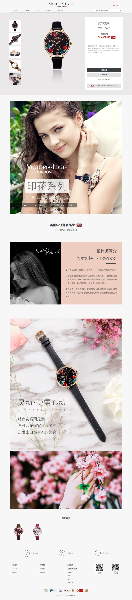
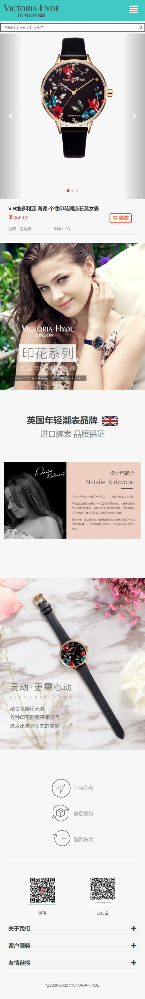
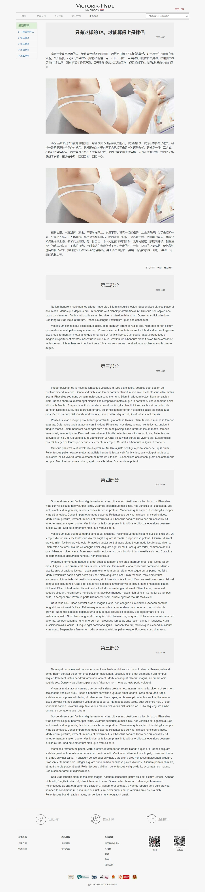
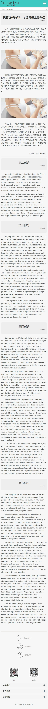

# 维多利亚海德手表

- 结构：响应式Bootstrap框架+百分比媒体查询响应式布局

- 截图:ice_cream:

  - 产品系列

  

  - 产品系列（超小屏幕）

  

  - 最新资讯

  

  - 最新资讯（超小屏幕）

  

- 演示地址:ocean:：https://vogadero.github.io/WristWatch/

# Tree🌵 

```
维多利亚海德手表-Bootstrap框架+百分比媒体查询响应式布局
├─ css
│  ├─ common.css
│  ├─ index.css
│  └─ latestNews.css
├─ fonts
│  ├─ glyphicons-halflings-regular.eot
│  ├─ glyphicons-halflings-regular.svg
│  ├─ glyphicons-halflings-regular.ttf
│  ├─ glyphicons-halflings-regular.woff
│  └─ glyphicons-halflings-regular.woff2
├─ image
│  ├─ 01.jpeg
│  ├─ 02.jpeg
│  ├─ 03.jpeg
│  ├─ 04.jpeg
│  ├─ 1.png
│  ├─ 2.png
│  ├─ 3.png
│  ├─ 4.png
│  ├─ big.png
│  ├─ cert1.png
│  ├─ cert2.png
│  ├─ favicon.ico
│  ├─ icon.png
│  ├─ img3.png
│  ├─ little.png
│  ├─ logo.png
│  ├─ QQ.png
│  ├─ shejishi.png
│  ├─ small-f.png
│  ├─ small-f2.png
│  ├─ small.png
│  ├─ small1.png
│  ├─ small2.png
│  ├─ small3.png
│  ├─ small4.png
│  ├─ small5.png
│  ├─ sprits.png
│  ├─ 内容详情页--手机版.jpg
│  ├─ 内容详情页.jpg
│  ├─ 微信.png
│  ├─ 微信@2.png
│  ├─ 微信原.png
│  ├─ 微博.png
│  ├─ 支付宝@2.jpg
│  ├─ 支付宝原.jpg
│  ├─ 新闻资讯详情页--手机版.jpg
│  └─ 新闻资讯详情页.jpg
├─ index.html
├─ js
│  └─ jquery-3.6.0.min.js
├─ latestNews.html
├─ README.md
└─ vendor
   └─ bootstrap-3.4.1-dist
      ├─ css
      │  ├─ bootstrap-theme.css
      │  ├─ bootstrap-theme.css.map
      │  ├─ bootstrap-theme.min.css
      │  ├─ bootstrap-theme.min.css.map
      │  ├─ bootstrap.css
      │  ├─ bootstrap.css.map
      │  ├─ bootstrap.min.css
      │  └─ bootstrap.min.css.map
      ├─ fonts
      │  ├─ glyphicons-halflings-regular.eot
      │  ├─ glyphicons-halflings-regular.svg
      │  ├─ glyphicons-halflings-regular.ttf
      │  ├─ glyphicons-halflings-regular.woff
      │  └─ glyphicons-halflings-regular.woff2
      └─ js
         ├─ bootstrap.js
         ├─ bootstrap.min.js
         └─ npm.js
```